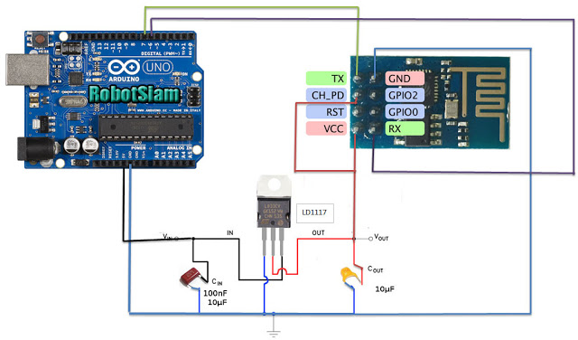

# ESP-01S (ESP8266)
About ESP-01S (ESP8266)

## How To

1. Install ESP-01S Driver

    - **Windows 10** - [Official - FT232 US UART](http://www.ftdichip.com/Drivers/VCP.htm) or [CDM v2.12.28 WHQL Certified.zip](Files/CDM-v2.12.28-WHQL-Certified.zip)

        Extract Folder and Update Driver

        

        

## Architecture

- ESP-01S (ESP8266)

    

    From [https://shopee.co.th/ESP8266-ESP-01S-ESP01S-Wireless-Wifi-Module-Wifi-Sensor-ESP8266-ESP-01-Upgrade-Version-DIY-for-Arduino-i.59553004.1355349742](https://shopee.co.th/ESP8266-ESP-01S-ESP01S-Wireless-Wifi-Module-Wifi-Sensor-ESP8266-ESP-01-Upgrade-Version-DIY-for-Arduino-i.59553004.1355349742)

- ESP-01S (ESP8266) with UNO R3 Circuit
    
    It need stable 3.3v. So It need to 5V with Regulator **LD1117**
    
    [โปรเจค ESP8266 ESP-01 ปิด เปิด ไฟ LED ผ่าน WiFi](https://www.robotsiam.com/article/26/%E0%B9%82%E0%B8%9B%E0%B8%A3%E0%B9%80%E0%B8%88%E0%B8%84-esp8266-esp-01-%E0%B8%9B%E0%B8%B4%E0%B8%94-%E0%B9%80%E0%B8%9B%E0%B8%B4%E0%B8%94-%E0%B9%84%E0%B8%9F-led-%E0%B8%9C%E0%B9%88%E0%B8%B2%E0%B8%99-wifi)
    
    

    Or Use External Power

    

## Connection

- For Programming (Connect 2 pin to `GND`)

    

- For General

    
